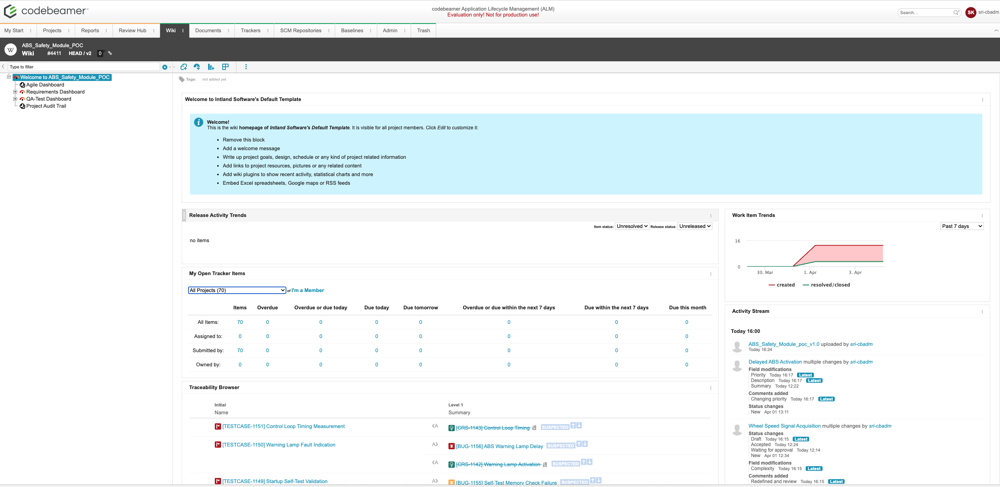
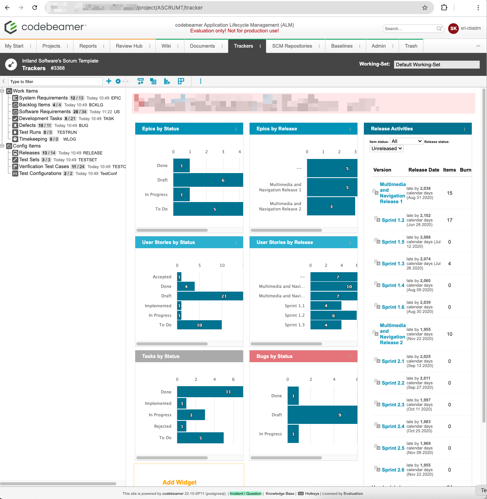
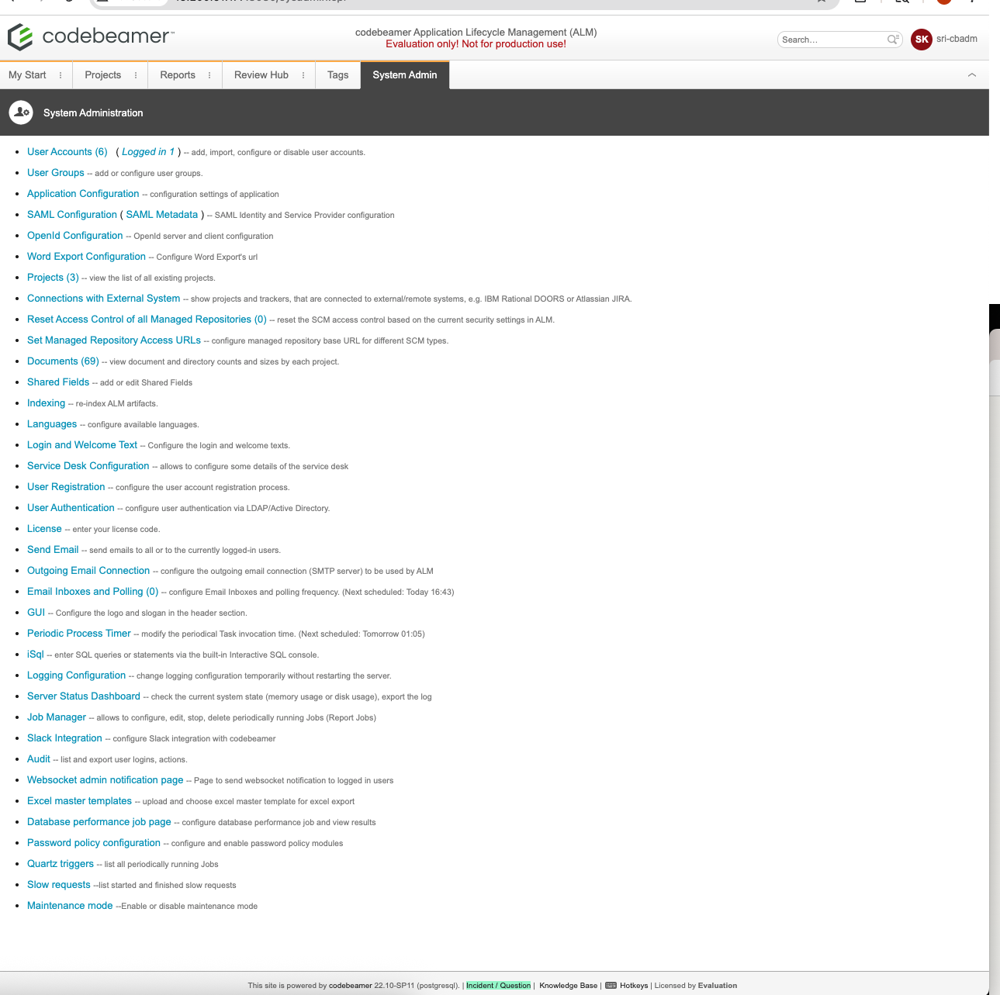
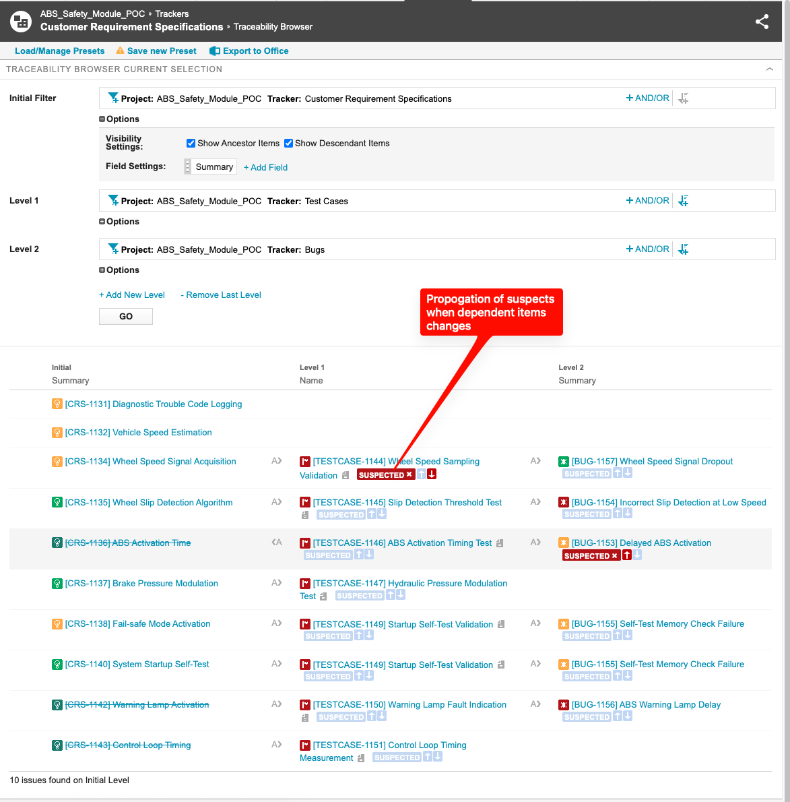
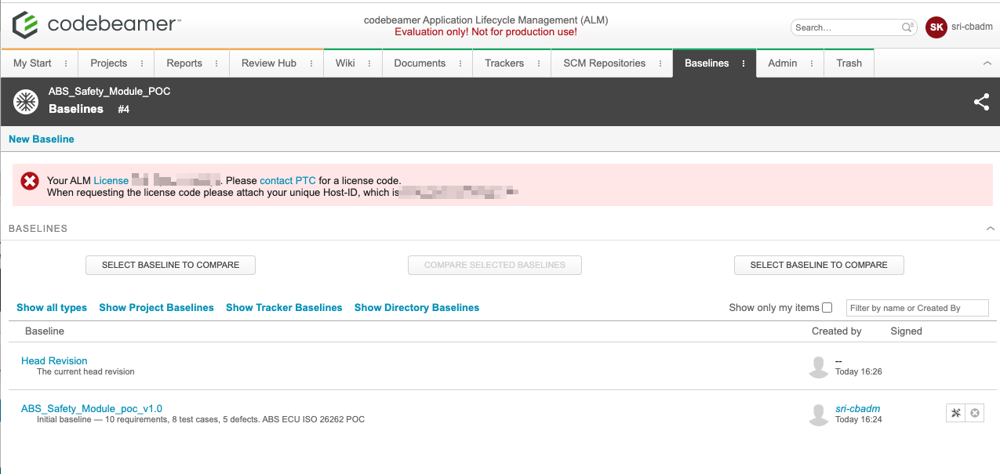
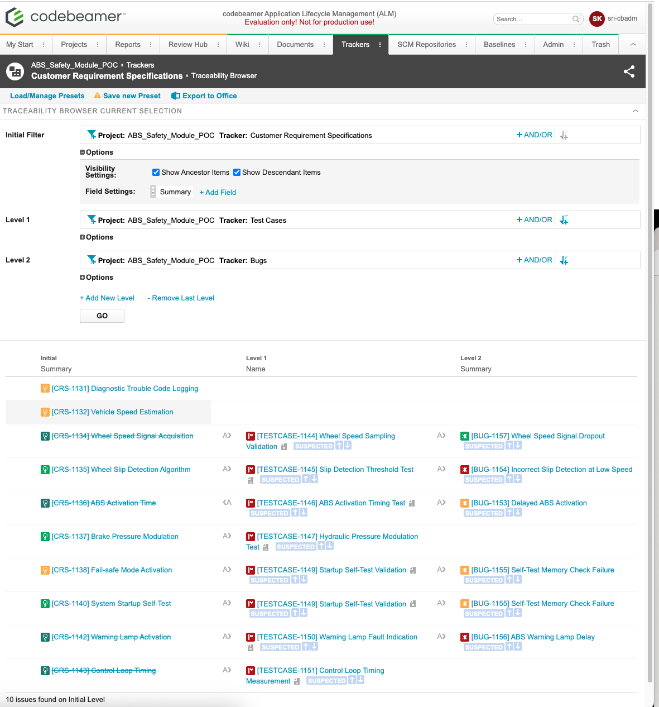

# Codebeamer ALM — Self-Hosted on Cloud

Self-hosted Codebeamer 22.10-SP11 on AWS EC2 using Terraform + Docker + PostgreSQL.
Built ABS Safety Module poc project with ISO 26262 context.

## Key Learnings
- CB import requires manual column mapping
- Associations direction matters for traceability browser
- Suspect propagation flags linked items on any change
- Baseline = frozen project snapshot for audit trail

## Stack
| Tool | Purpose |
|------|---------|
| Codebeamer 22.10-SP11 | ALM Platform |
| AWS EC2 (t3.large) | Cloud hosting |
| Terraform | Infrastructure as Code |
| Docker | Containerization |
| PostgreSQL 12 | Database |

## Project — POC — ABS Safety Module (ISO 26262)
- 10 Customer Requirements (CRS tracker)
- 08 Test Cases with V-model traceability
- 05 Defects linked to requirements
- Traceability matrix (CRS → Test Cases → Bugs)
- Suspect propagation configured (bi-directional)
- Baseline: ABS_Safety_Module_v1.0

## Screenshots
### Project Dashboard

### Admin Panel

### Traceability Matrix

### Baseline

### Requirements Tracker

## Next Steps
- Integeration, Infra optimization, aunthentication
