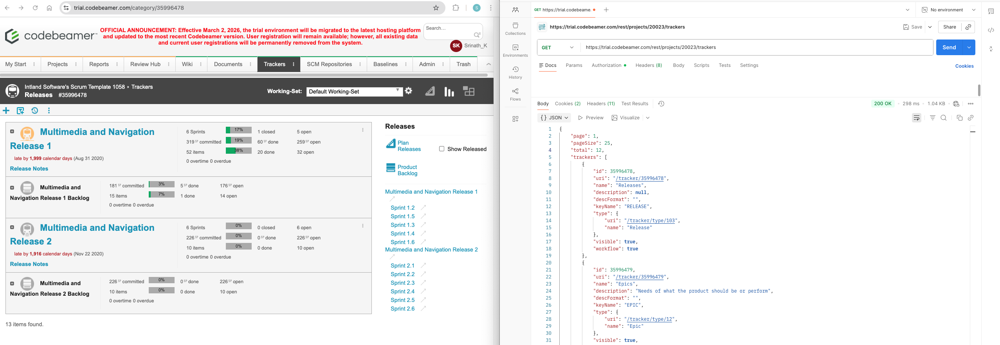

# Codebeamer REST API Exploration

## Objective
Refresh basic understanding on REST API consumption using Postman.

## Environment
- Tool: Postman
- Target: Codebeamer Trial Instance
- Authentication: Basic Auth

---

## API Calls Performed

### Get All Projects
GET /rest/projects

Status Code: 200 OK

Observation:
- Retrieved project metadata in JSON format.
- Validated successful authentication.

---

### Get Project Trackers
GET /rest/projects/20023/trackers

Status Code: 200 OK

Observation:
- Response included pagination fields:
  - page
  - pageSize
  - total
- Observed hierarchical REST design:
  /projects/{id}/trackers

---

## Key Learnings

- Successful server-side processing - 200 OK.
- Pagination improves scalability and performance.
- REST uses hierarchical resource structure.
- HTTP protocol and methods trail.
- OpenAPI (Swagger) defines API contracts and documentation.

---     
