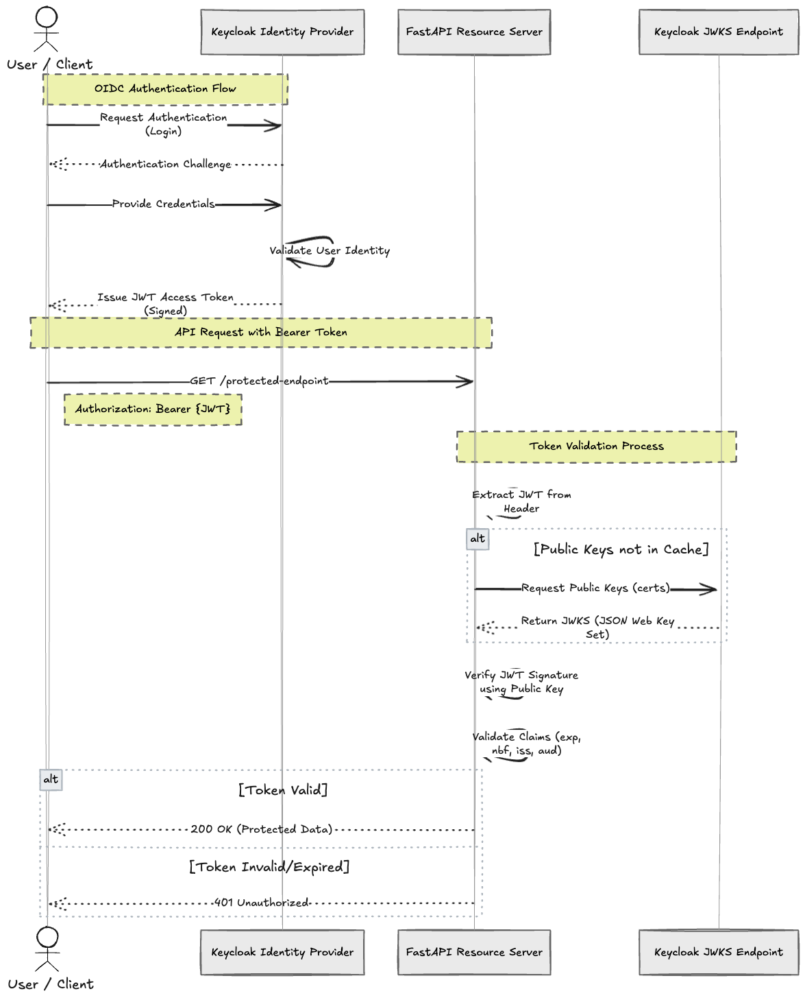
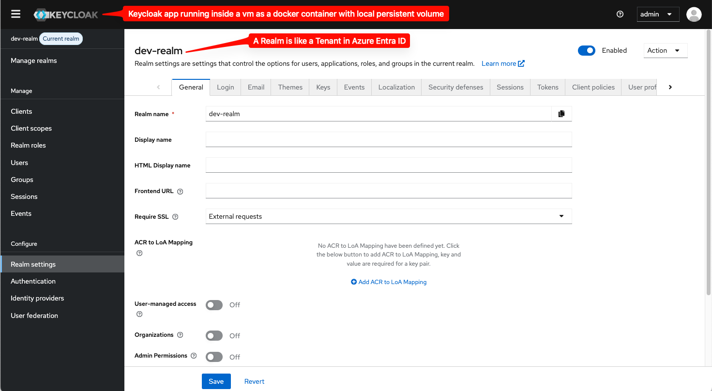
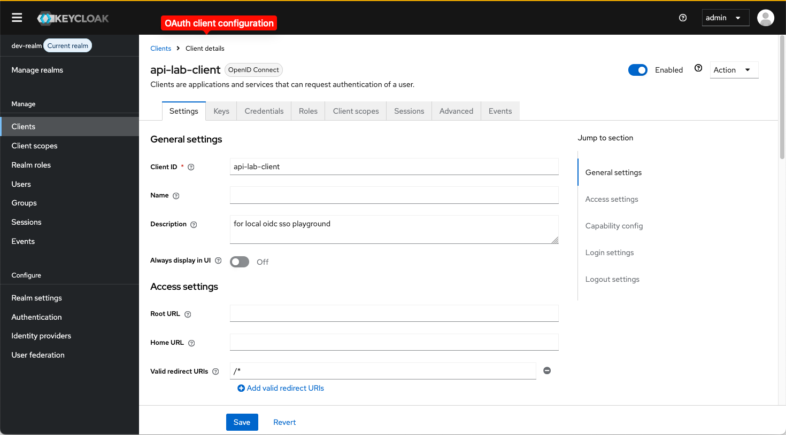
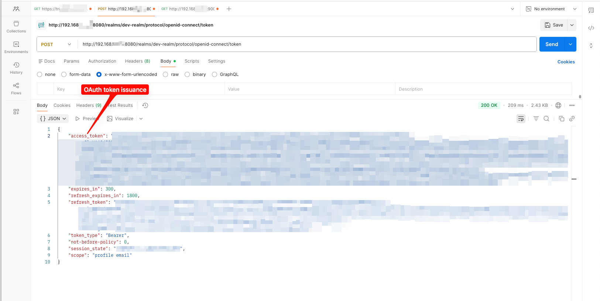
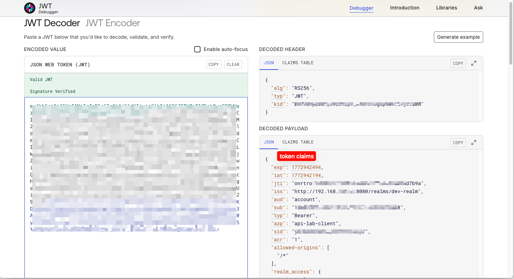
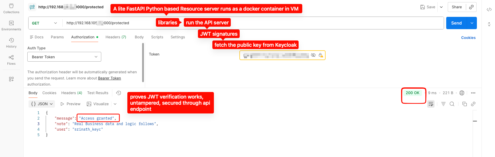
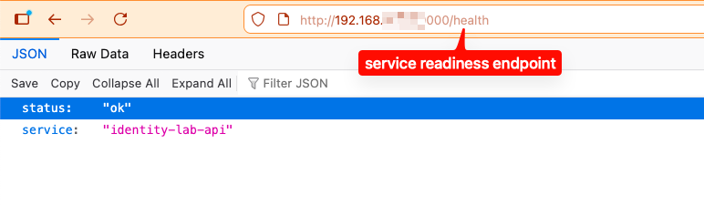

# Identity Lab: OAuth2 / OIDC / JWT Verification

This project demonstrates a minimal identity architecture used in modern enterprise systems.

Components used:

- **Keycloak** – OpenID Connect Identity Provider
- **FastAPI** – Resource server exposing protected APIs
- **JWT** – Access tokens used for authentication
- **JWKS** – Public keys used to verify token signatures


## Architecture




## Authentication Flow

1. A client requests an access token from the Keycloak token endpoint.
2. Keycloak authenticates the user and issues a signed JWT.
3. The client calls the protected API endpoint using `Authorization: Bearer <token>`.
4. The API server retrieves the JWKS public key from Keycloak.
5. The API verifies the JWT signature and token claims.
6. If verification succeeds, the protected resource is returned.

This lab simulates how enterprise applications authenticate API requests using an identity provider and token based authentication.


## API Endpoints

### Health Check

`GET /health`

Returns service status.

Example response:
```
{
  "status": "ok",
  "service": "identity-lab-api"
}
```

### Protected Endpoint

`GET /protected`

Requires a valid JWT access token.

```
Authorization header:
Authorization: Bearer <access_token>
```

Example response:
```
{
  "message": "Access granted",
  "note": "Real Business data and logic follows",
  "user": "srinath_keyc"
}
```

## Screenshots

### Keycloak Realm Configuration



### OAuth Client Configuration



### Token Request (Postman)



### JWT Token Decoded



### Protected API Endpoint



### Health Endpoint




## Setup / How to Run

### Prerequisites

- Python 3.10+
- Keycloak running locally
- A configured realm, client, and user
- Access token obtained from the Keycloak token endpoint

### Install dependencies

Create a virtual environment:

```
python3 -m venv venv
source venv/bin/activate
```

Install required packages:

```
pip install -r requirements.txt
```

## Run the API server
```
uvicorn api_server:app --host 0.0.0.0 --port 9000
```

The API server will be available at:
`http://localhost:9000`

### Test endpoints

#### Health check:
`GET /health`

#### Protected endpoint:
```
GET /protected
Authorization: Bearer <access_token>
```

## Troubleshooting / Observations

• Keycloak user creation required profile fields even though they were not marked mandatory in the UI.

• Keycloak was run using a Docker container with a persistent volume to preserve realm configuration across container restarts.

• JWT audience validation initially failed during API verification. For this lab the strict audience check was disabled.

• Python package installation basically require using a virtual environment due to avoid externally managed environment restriction.

## Skills Demonstrated

- OAuth2 / OpenID Connect authentication flow
- JWT access token handling
- JWKS public key verification
- Identity provider integration using Keycloak
- Building protected APIs using FastAPI
- Token based authentication for microservices

## Enterprise Identity Mapping

This lab uses Keycloak as the identity provider, but the same architecture
can be implemented in enterprise environments using other platforms.

| Lab Component | Enterprise Equivalent |
|---|---|
| Keycloak Realm | Azure Entra ID Tenant |
| OAuth Client | App Registration |
| JWT Access Token | Access Token issued by Identity Provider |
| JWKS Endpoint | Public Key Endpoint used for token verification |
| FastAPI Resource Server | Backend microservice (Spring Boot / Node / Go) |

## Where such Architecture Is Used

The identity architecture demonstrated in this lab is commonly used in modern enterprise systems.

Examples include:

- Azure Entra ID / Azure AD issuing OAuth2 access tokens
- Okta or Ping Identity acting as OpenID Connect providers
- Microservices verifying JWT tokens using JWKS endpoints
- API gateways enforcing authentication before forwarding requests
- Internal platform services validating user identity for protected APIs

In production environments, this pattern allows applications to delegate authentication
to a centralized identity provider while resource servers independently verify tokens.